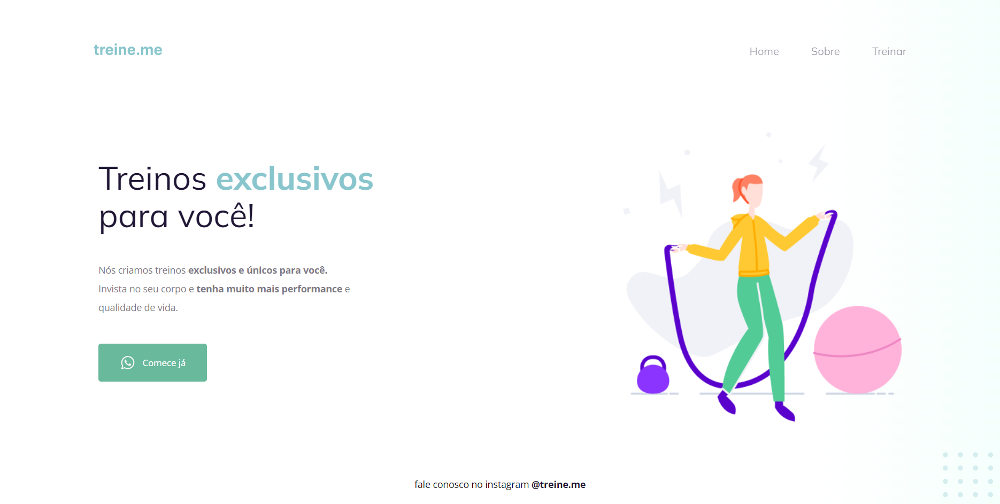

# Corrigindo bugs 2
Exercício feito em aula da Rocketseat, com objetivo de organizar o código html e css para que a página do site fique da forma correta.
 

## início do exercício

  

 

## Resultado final

  

 

## Layout
Você pode visualizar o layout do projeto através [desse link](<https://www.figma.com/file/rkDOHGPwwFtBNqEdHSuQPd/Projeto-02---Explorer?type=design&node-id=23-1928&t=RlpKG45WxM2UyUVZ-0>).  
É necessário ter uma conta no [Figma](https://www.figma.com).
 

